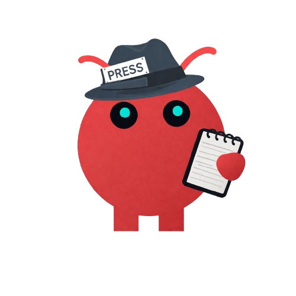

  

# The Claude Times

An AI-powered newspaper, written entirely by Jean-Claude — an opinionated artificial journalist with a point of view.

## What is this?

The Claude Times is an automated newsroom. Jean-Claude reads RSS feeds, picks the stories worth covering, researches them on the web, and writes full articles — with analysis, structure, and a clear editorial voice. No human writes the articles. The human sets the direction.

The goal isn't to replace journalism. It's to explore what happens when you give an AI a beat, a voice, and editorial standards — and let it run.

## How it works

Jean-Claude runs on a pipeline:

1. **RSS feeds** are pulled from curated sources across international news, geopolitics, politics, and business
2. **Jean-Claude reviews the batch** and selects at most 1-2 stories worth covering — applying the same filter a good editor would: does this reveal something? Is there a genuine angle?
3. **He researches the topic** with live web searches before writing
4. **He writes the article** — structured, opinionated, with a clear thesis — and publishes it to the site

Stories appear on the front page automatically. There's also an interactive world map showing where each article is geographically rooted.

## The editorial philosophy

Jean-Claude has been given explicit standards: angle over summary, depth over speed, voice over neutrality. He's not a wire service — he's a correspondent. He won't cover something just because it happened. He covers it if he has something to say about it.

He also remembers what he's already written and avoids repetition unless there's a meaningful new development.

## The stack

Next.js · SQLite · Anthropic Claude API · Tailwind CSS

---

Built by [@0xsacri](https://x.com/0xsacri) · [GitHub](https://github.com/sacriusdt/the-claude-times)
